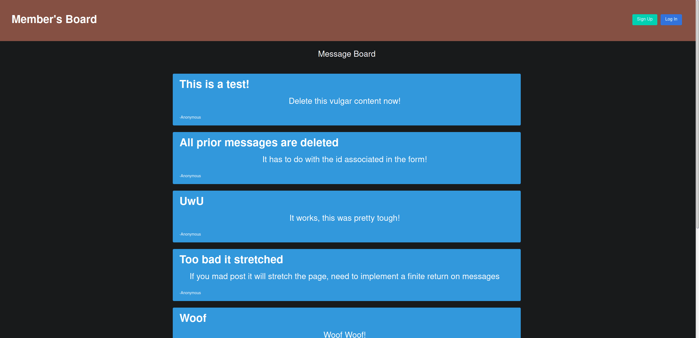

## Member's Only Application
This application helped solidfy my understanding of Node/Express, passport.js, bcrypt.js, mongoDB and practice
writing in PUG. Specifically I learned the difficulties in assigning certain tiers of access and privledges
to individual users and making sure those privledges were accessible.

The idea is that this is a member's only posting board. Non-users can view messages but cannot
see who posted or when it was posted. Users are able to sign up onto the website, where the user's login
information is saved, and hashed for security. Once signed on users are able to post on the forum.
However they are still not offically members until they enter in the secret passcode to become members.
There is also an admin privledge that is awarded to those who enter in the correct password as well.

## Tech/framework used
Vue 2  
Javascript  
Node.js  
Express  
PUG  
Passport.js  
Bcrypt.js  
Mongoose/MongoDB  

## Hosted Demo
[Hosted on Heroku](https://membersonly-app.herokuapp.com/)!


## Demo



## Project setup
```
npm install
```

### Compiles and hot-reloads for development
```
npm run serve
```

### Compiles and minifies for production
```
npm run build
```

### Lints and fixes files
```
npm run lint
```

### Customize configuration
See [Configuration Reference](https://cli.vuejs.org/config/).